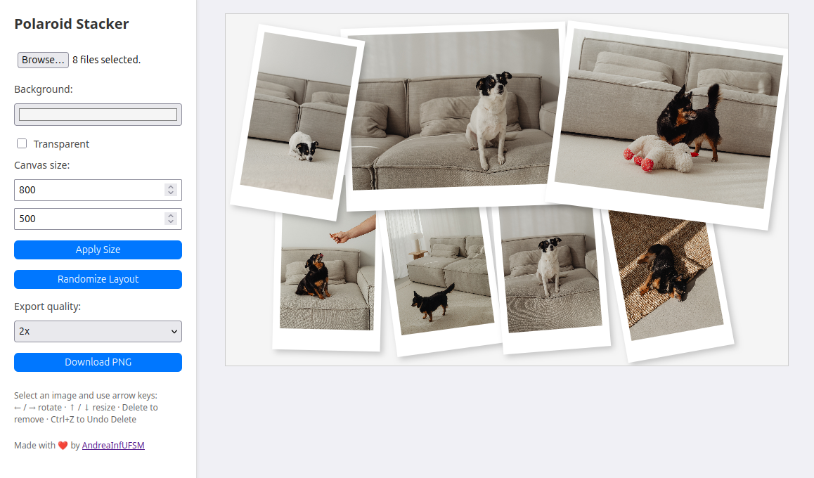

# 📸 Polaroid Stacker

**Polaroid Stacker** is a minimalistic in-browser tool for quickly creating polaroid-style image layouts. Upload, arrange, rotate, and export your own custom stack of images with ease — no installation or dependencies needed.

 <!-- Replace with your actual screenshot if available -->

## Features

- Drag and drop image uploads
- Adjustable canvas size and background color
- Resize and rotate images via keyboard (arrow keys)
- Delete and undo
- Export high-resolution PNG (1x–4x)
- Randomized layout generation

## How to Use

1. **Live version** [here](https://andreainfufsm.github.io/polaroid-stacker) or  **Open `index.html` in your browser** (no server needed).
2. **Upload images** using the file input.
3. **Use your mouse** to drag images around.
4. **Keyboard controls:**
   - `←` / `→` rotate image
   - `↑` / `↓` resize image
   - `Delete` to remove
   - `Ctrl + Z` to undo delete
5. **Click "Download PNG"** to export your design.

## Tech Stack

- Vanilla HTML, CSS, and JavaScript
- No external libraries
- Fully client-side

## Credits

Inspired by [beautystack](https://github.com/mrtcode/beautystack) from [Martynas Bagdonas](https://github.com/mrtcode)

Pictures from [kaboompics](https://kaboompics.com/photoshoot/two-small-dogs-hang-out-in-their-home)

Made with ❤️ by [AndreaInfUFSM](https://github.com/AndreaInfUFSM) 

---

